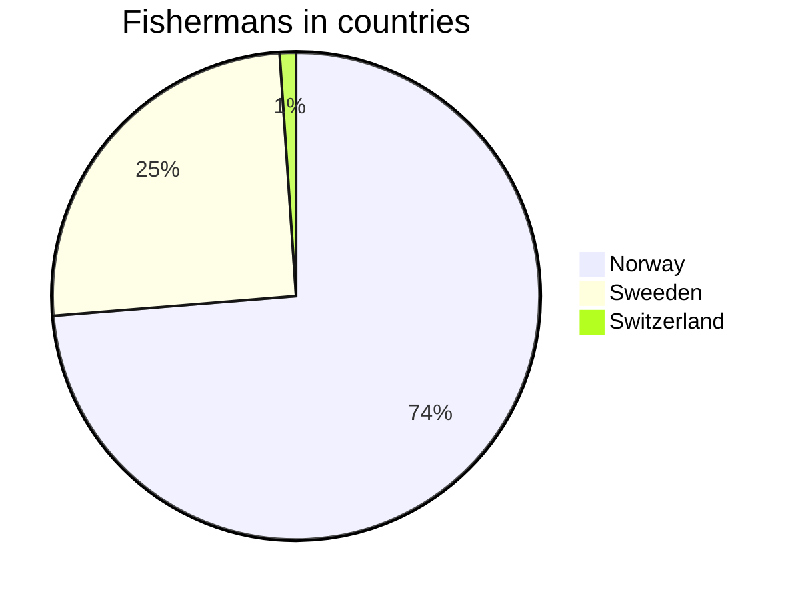
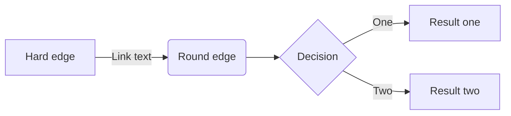
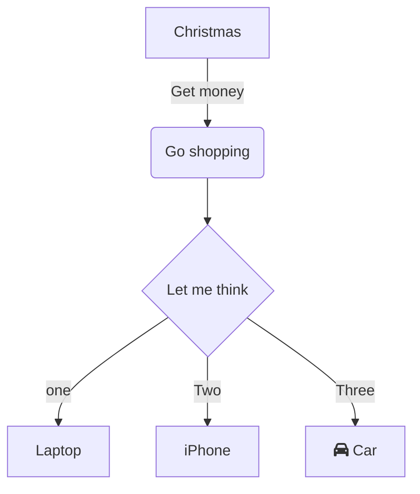
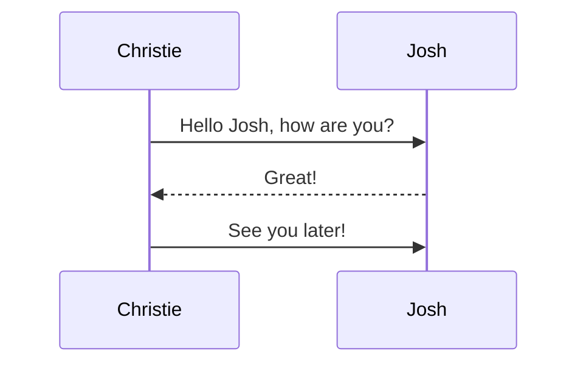
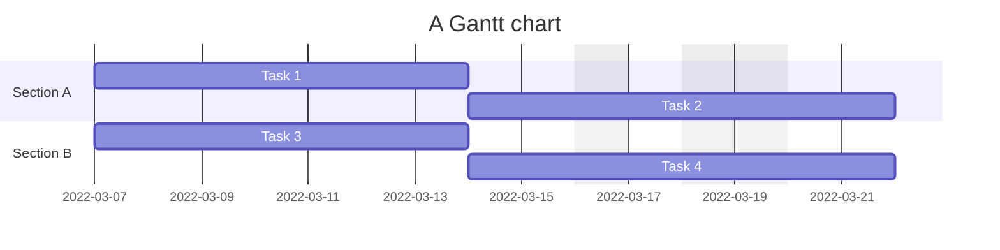
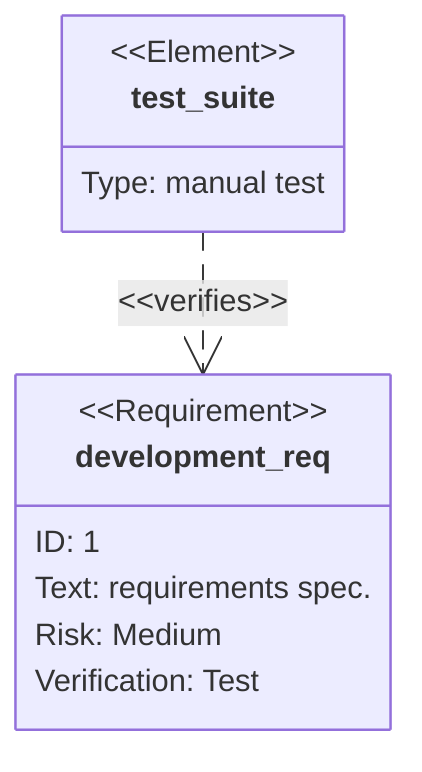
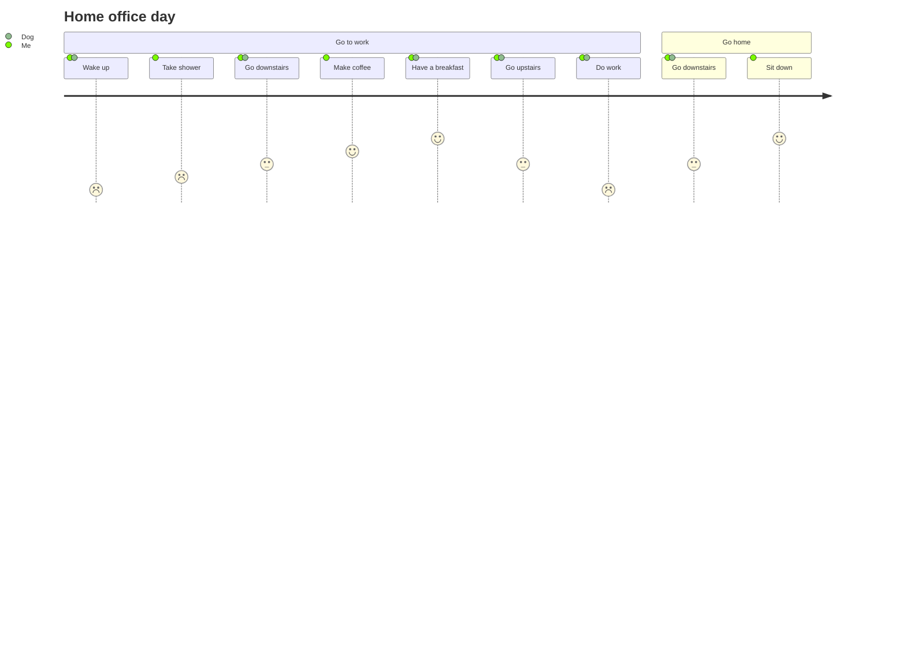
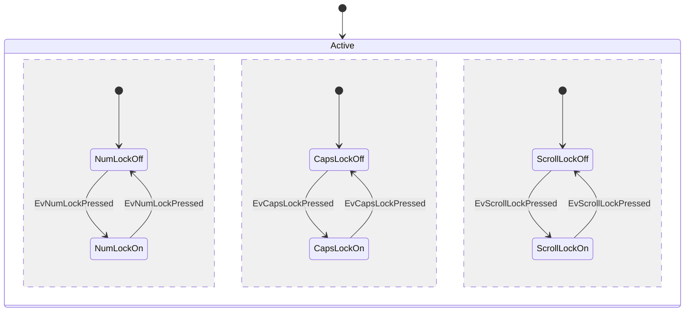
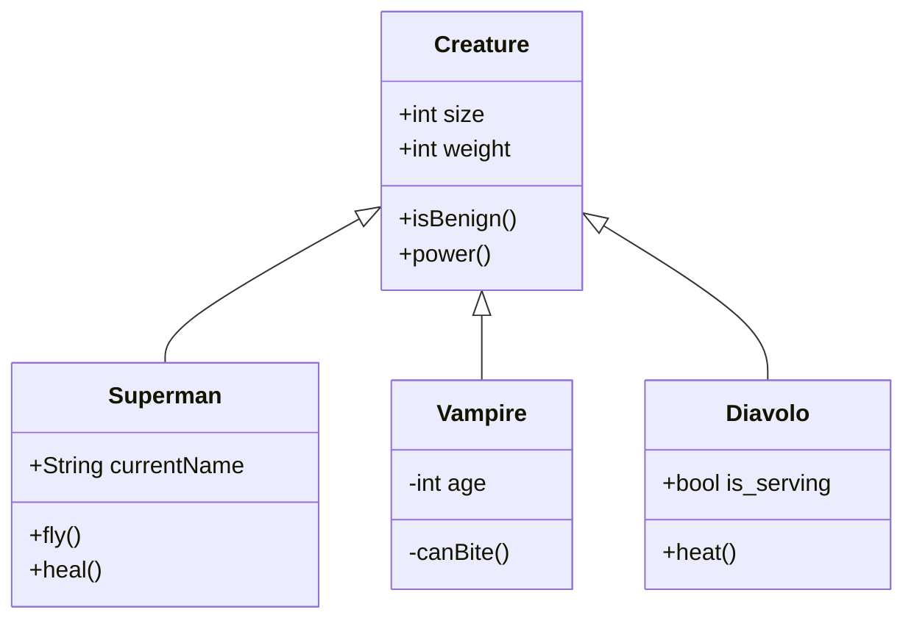

# Mermaid diagrams

## Sintaxis

### Azure DevOps

Los diagramas en Azure DevOps se inicializan con tres simbolos de dos puntos (:) seguidos de la palabra **mermaid**, y termina con tres simbolos de dos puntos.

        :::mermaid
        diagrama
        :::

### GitHub

En GitHub los mismos diagramas empiezan por tres simbolos de tilde invertida (`).

        ```mermaid
        diagrama
        ```

## Tipos de diagrama

### Gráfico de sectores



        :::mermaid
        pie title Fishermans in countries
            "Norway" : 684
            "Sweeden" : 234
            "Switzerland" : 10
        :::       

### Gráfico horizontal



        :::mermaid
        graph LR;
            A[Hard edge] -->|Link text| B(Round edge) --> C{Decision}
            C -->|One| D[Result one]
            C -->|Two| E[Result two]
        :::

### Gráfico vertical



        :::mermaid
        graph TD
            A[Christmas] -->|Get money|B(Go shopping)
            B --> C{Let me think}
            C-->|one|D[Laptop]
            C-->|Two|E[iPhone]
            C-->|Three|F[fa:fa-car Car]
        :::

### Diagrama de secuencia



        ::: mermaid
        sequenceDiagram
            Christie->>Josh: Hello Josh, how are you?
            Josh-->>Christie: Great!
            Christie->>Josh: See you later!
        :::
        
### Diagrama Grantt



        ::: mermaid
        gantt
            title A Gantt chart
            dateFormat YYYY-MM-DD
            excludes 2022-03-16,2022-03-18,2022-03-19
            section Section

            A task          :a1, 2022-03-07, 7d
            Another task    :after a1 , 5d
        :::

### Diagrama de requerimientos



        :::mermaid
        requirementDiagram
            requirement development_req {
            id: 1
            text: requirements spec.
            risk: medium
            verifymethod: test
            }
            element test_suite {
            type: manual test
            }
            test_suite - verifies -> development_req
        :::

### Diagrama de jornada



        :::mermaid
        journey
            title Home office day
            section Go to work
            Wake up: 1: Me, Dog
            Take shower: 2: Me
            Go downstairs: 3: Me, Dog
            Make coffee: 4: Me
            Have a breakfast: 5: Me, Dog
            Go upstairs: 3: Me, Dog
            Do work: 1: Me, Dog
            section Go home
            Go downstairs: 3: Me, Dog
            Sit down: 5: Me
        :::

### Diagrama de estado v2



        :::mermaid
        stateDiagram-v2
            [*] --> Active
            state Active {
                [*] --> NumLockOff
                NumLockOff --> NumLockOn : EvNumLockPressed
                NumLockOn --> NumLockOff : EvNumLockPressed
                --
                [*] --> CapsLockOff
                CapsLockOff --> CapsLockOn : EvCapsLockPressed
                CapsLockOn --> CapsLockOff : EvCapsLockPressed
                --
                [*] --> ScrollLockOff
                ScrollLockOff --> ScrollLockOn : EvScrollLockPressed
                ScrollLockOn --> ScrollLockOff : EvScrollLockPressed
            }
        :::

### Diagrama de clases



        :::mermaid
        classDiagram
            Creature <|-- Superman
            Creature <|-- Vampire
            Creature <|-- Diavolo
            Creature: +int size
            Creature: +int weight
            Creature: +isBenign()
            Creature: +power()
            class Superman{
                +String currentName
                +fly()
                +heal()
            }
            class Vampire{
                -int age
                -canBite()
            }
            class Diavolo{
                +bool is_serving
                +heat()
            }
        :::

## Referencias

[Microsoft Learn](https://learn.microsoft.com/en-us/azure/devops/project/wiki/markdown-guidance?view=azure-devops)

[GitHub](https://gist.github.com/ChristopherA/bffddfdf7b1502215e44cec9fb766dfd)

[Mermaid](https://mermaid.js.org/syntax/examples.html)
