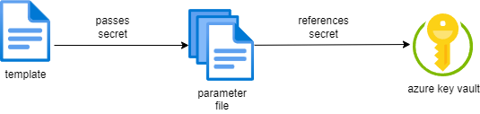

# Implmenentando infraestructura y configuración como código

## Requerimientos técnicos

* Una suscripción de Azure, para ejecutar plantillas ARM y Azure Automation.
* PowerShell con el módulo de Azure PowerShell ([Azure PowerShell](https://learn.microsoft.com/en-us/powershell/azure/install-azure-powershell?view=azps-11.2.0&viewFallbackFrom=azps-7.3.0)).
* Azure CLI para ejecutar plantillas ARM ([Azure CLI](https://docs.microsoft.com/en-us/cli/azure/)). 

## Teniendo todo como código

La causa más común de una deriva de configuración es un cambio manual. Cuando haces cambios manuales existe siempre el riesgo que aplique diferentes ajustes a diferentes servidores o hosts. Si necesitas poner a escala y añadir otro servidor en tu entorno productivo, la oportunidad de que ese servidor tome la misma configuración como todos los existentes es muy pequeña.

> [!TIP]
> Declarativo e imperativo son dos enfoques principales adopatados para implementar **Infrastructure as Code (IaC)** y **Configuration as Code (Cac)**.

El primer paso para hacer esto es especificando el estado deseado de la configuración e infraestructura. El estado deseado es entonces alimentado dentro de la configuración gestionada que refuerza esta configuración en tu infraestructura. Especificando solo el estado deseado es llamado un acercamiento declarativo, con el que difiere de un acercamiento imperativo, donde tu especificas todos lso pasos que necesitas ser dados. 

Algunas de esas herramientas son a menudo capaces de comprobar el estado actual de tu infraestructura y configuración en intervalos regulares y replicando tu estado deseado if alguna desviación es detectada. Esto hace aplicar una operación idempotente.

> [!TIP]
> Una operación es idempotete is puede ser repetida una o más veces, mientras la salida siempre sea la misma.

Cuando adpotas IaC y CaC, tú puedes ir más rápido para recrear la infraestructura completa antes de desplegar una aplicación, desplegando una aplicación en una nueva infraestructura y entonces sin tener en cuenta la antigua infraestructura después cambiando al nuevo despliegue. El beneficio añadido de este enforque es que tu ahora estas garantizado que no habrá rastros de algúna configuración o binarios del despliegue previo. 

Es importante entender que eso es complementario y es usado junto a menudo. Las plantillas ARM pueden ser usadas para crear máquinas virtuales en Azure, PowerShell DSC o Ansible pueden ser usadas para configurar esas máquinas virtuales.

## Trabajando con plantillas ARM

Las plantillas ARM son escritas en JSON

            {
                "$schema": "https://schema.management.azure.com/schemas/2019-04-01/deploymentTemplate.json#",
                "contentVersion": "1.0.0.0",
                "parameters": {
                },
                "variables": {
                },
                "resources": {
                },
                "outputs": {
                }
            }

La propiedad **$schema** es requerido y el número de la versión depende del ambiente de despliegue y del editor JSON. La propiedad **contentVersion** especifica la versió del contenido.

### Parámetros

La sección de parámetros esta usualmente cerca de la parte superior de la plantilla. Antes iniciar despliegues, ARM resolverá los valores de los parámetros. Los valores son referenciados cuando el parámetro es encontrado en la plantilla por ARM.

El uso de esta sección es para declarar uno o más parámetros que pueden ser especificos por el llamador de la plantilla ARM antes de desplegarlo. Una razón común para usar la sección de parámetros es usar la misma plantilla para los entornos de test y producción pero varia los nombres de los recuersos entre ambos. 

            {
                "appServiceName": {
                    "type": "string",
                    "metadata": {
                        "description": "a free to choose text
                    }
                }                
            }

Para cada parámetro, una nueva clave es especificada con el nombre del parámetro. El valor como objeto tiene una clave requerida, **type**. Los valores para **type** son: *string*, *int*, *bool*, *object*, *array*, *secureString*, y *secureObject*. Los valores *secureString* y *secureObject* pueden ser usados para hacer seguro que los valores en tiempo de ejecución de esos parámetros son eliminados de cualquier log y salida. Son intencionados para mantener contraseñas, claves y otros secretos. 

El objecto metadata con su clave **description** es opcional y puede ser usada para añadir una descripción de los parámetros para una futura referencia.

Otras proiedades que pueden ser especificadas:

* **minValue** and **maxValue** para especificar los límites en un valor entero.
* **minLength** and **maxLength** para especificar los límites de la longitud de un texto.
* **defaultValue** para especificar el valor por defecto que usará si el valor no es especificado cuando se aplique la plantilla.
* **allowedValues** para especificar un array de valores permitidos limitando los valores de entrada.

### Parámetros de fichero

Puedes hacer uso de un fichero JSON que contiene los parámetors especificandolos como valores en tu script. Una simple plantilla es acompañado por más de un parámetro de fichero, por ejemplo, uno para test y otro para producción.

            {
                "$schema": "https://schema.management.azure.com/schemas/2019-04-01/deploymentParameter s.json#",
                "contentVersion": 1.0.0.0",
                "parameters": {
                    "exampleParameter": {
                        "value": "exampleValue"
                    }
                }
            }

Cada parámetro de fichero es un objeto JSON con las propiedades requeridas **$schema** y **contentVersion**. La tercera propiedad **parameters** es usada para especificar uno o más parámetros, especificando nombre como clave y objeto como valor. 

Esta solución no es últil para secretos. 

Keys passwords, and other secrets should not be stored as paintext in source control in a paramter file.

            {
                "$schema": "https://schema.management.azure.com/schemas/2019-04-01/deploymentParameters.json#",
                "contentVersion": "1.0.0.0",
                "parameters": {
                    "exampleSecretParameter": {
                        "reference": {
                            "keyvault": {
                                "id": "/subscriptions/.../Microsoft.KeVault/vaults/<vaultname>"
                            },
                            "secretName": "myKeyVaultSecretName"
                        }
                    }
                }
            }

Cuando desplieguas la plantilla, este secreto es tomado desde el key vault y usado en el despliegue. Esto es permitido solo is el usuario o servicio inicia el despliegue tiene role de propietario o contribuidor en relación al key vault, y el key vault esta habilitado para el despliegue de plantillas.

> [!TIP]
> Algún rol que incluya permisos *Microsoft.KeyVault/vaults/deploy/action* podrá trabajarlo. Puedes crear roles personalizados que incluya esta acción.

### Variables

La sección variables es usada para especificar uno o más valores que serán usados mediante la plantilla. El nombre del párametro es *environmentName*. Las variables son usadas para especificar que no pueden ser especificadas desde fuera de la template pero deben ser reconocidas como configurables. 

            "Variables": {
                "appServicePlanType": "B1",
                "appServiceName": "[concat('myAppService-', parameteres('environmentName'))]
            }

### Functions

Son usadas para permitir la dinámica evaluación de propiedades en las plantillas ARM. Pueden retornar valores como texto o numérico, o como array de objetos. Alguna propiedad puede ser accedida usando la notación *.propertyName*.

            "myVariable": "[concat('myAppServices-', parameters('environmentName'))]"

Ello puede ser usado para manipular textos, recuperar detalles sobre la subscripción actual, grupo de recursos, o tenant de Azure Active Directory (AAD), u obtener detalles de los recursos.

Las funcionaes pueden ser también usadas para recuperar claves u otros secretos.Inserta claves directamente desde el servicio que expone la clave para los ajustes de la aplicación o key vault.

### Comments and metadata

Una plantilla ARM puede contener secciones, comentarios y metadatos.

#### Comentarios

// es usado para comentar un línea, /* */ es usado para comentar un bloque.

            {
                "appServiceName": {
                    // this is a single line comment
                    "type": "string",
                    /*
                        This is a multi-line comment
                    */
                    "metadata": {
                        "description": "The name of the web app that you wish to create.",
                        "author": author Name"
                    },
                    "location": "[
                        parameters('location')
                    ]" // defaults to resource group location
                }                
            }

> [!TIP]
> Para desplegar plantillas con textos multilinea y comentar, usa Azure PowerShell o Azure CLI. Para CLI usa la versión 2.3.0 or posterior, y especifica el formato --handle-exteded-json.

#### Metadata

El texto que añades a la descripción metadata es automaticamente usada como consejo para ese parámetro.ARM ignorará el objeto metadata, y esto puede ser usado en cualquier lugar de la plantilla.

### Resources

Los recursos son la parte principal de la plantilla, donde todos los recursos para ser creados son especificados.

            {
                "type": "Microsoft.Sql/servers",
                "apiVersion": "2021-02-01-preview",
                "name": "mySqlServer",
                "location": "West Europe",
                "properties": {
                    "administratorLogin": "myUsername",
                    "administratorLoginPassword": "myPassword",
                    "version": "12.0"
                }
            }

* El tipo de recurso para ser creado o modificado necesita ser especificado. *resourceProvider* y el nombre del tipo de recurso que pertenece.
* La versión del REST API para usar este recurso. 
* El nombre para el recurso: cada tipo de recurso tiene sus reglas para determinar un nombre válido.
* Requiere una localización, debes especificar uno para cada recurso. La localización debe ser una región de Azure.

### Recursos dependientes

Un tipo especial de recursos es el recurso dependiente. Para un tipo de recurso anidado, el tipo y nombre reflejan este anidameniento.

            {
                "apiVersion": "2021-11-01",
                "name": "myNamespaceName/myTopicName",
                "type": "Microsoft.Servicebus/namespaces/topics",
                "dependsOn": ["Microsoft.ServiceBus/namespaces/myNamespaceName]
            }

La propiedad extra, *dependsOn*, es requerida para especificar el recurso aninado que solo puede ser creado después del recurso contendor existente. La propiedad *location* no es necesario.

Cuando la propiedad *dependson* es utilizada, una dependencia explicita de despliegue entre el recurso hijo y el recurso padre es establecido automátcamente. El recurso hijo será desplegado después del padre. La función *resourceID* retorna el identificador único del recurso.

            {
                "type": "Microsoft.Sql/Servers",
                "apiVersion": "2020-02-02-preview",
                "name": "[parameteres('serverName')]",
                "location": "[parameters('location')]",
                "resources": [
                    {
                        "type": "databases",
                        "name": "[parameters('sqlDBName')]",
                        "location": "[parameters('location')]",
                        "dependsOn": [
                            "[resourceId('Microsoft.Sql/servers', concat(parameters('serverName')))]
                        ]
                    }
                ]
            }

> [!IMPORTANT]
> Una dependencia circular es un problema con el orden de dependencia, resultando en el despliegue un bucle que le impide completar el despliee. ARM identifica las dependencias circulares durante la validación de la plantilla.

### Plantillas anidadas

Otro tipo especial de recurso son las plantillas anidadas, que pueden lanzar el despliegue de otra plantilla.

            {
                "ype": "Microsoft.Resources/deployments",
                "apiVersion": "2021-04-01",
                "name": "linkedTemplate",
                "properties": {
                    "mode": "Incremental",
                    "templateLink": {
                        "uri": "https://.../myLinkedTemplate.json"
                    },
                    "parametersLink": {
                        "uri": "httsp://.../myParameters.json"
                    }
                }
            }

La localización de las plantillas y ficheros de parámetros son HTTP y HTTPS con un **Identificador uniforme de recursos - Uniform Resource Identifier (URI)**, pero tienen que ser localizaciones publicas. La plantilla URI necesita ser accedida externamente. Para ganar acceso durante el despliegue, añade token SAS a la plantilla como alternativa, una propiedad de plantilla puede ser especificada. No puedes usar ambos, parámetros en linea y un vínculo de un fichero de parámetros.

### Salidas

Las claves son retornadas al llamante de la plantilla. El llamante puede usar esos valores para iniciar otra tarea o script y usar una o más de los valores creados o usarlos por la plantilla. 

El principal uso de esto es prevenir harcodear nombres y otros valores dinámicos, especialmente IP's en una automatización. La sección de salida es un objeto JSON.

            {
                "outputName": {
                    "type": "string",
                    "value": "myValue"
                }
            }

Las funciones son usadas para recuperar valores desde parámetros, variables o otros recursos creados. 

