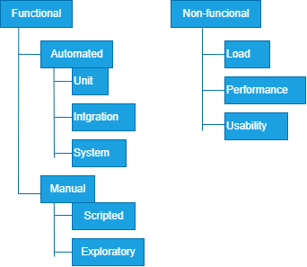
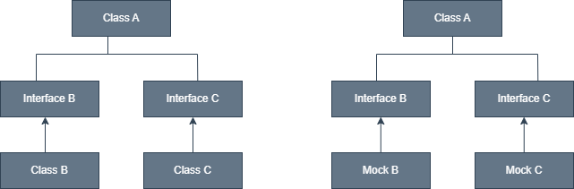
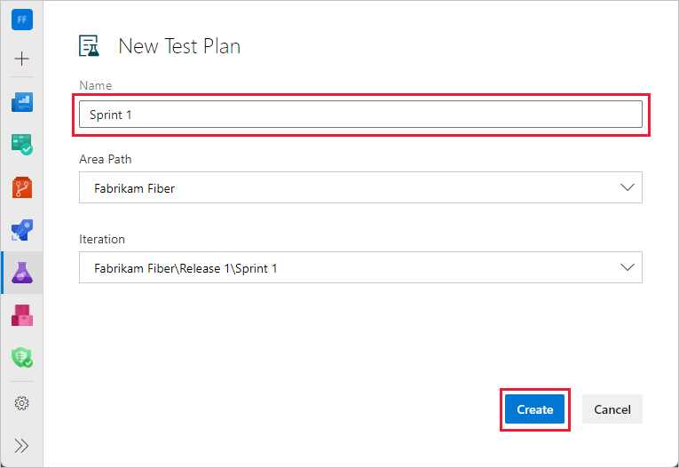
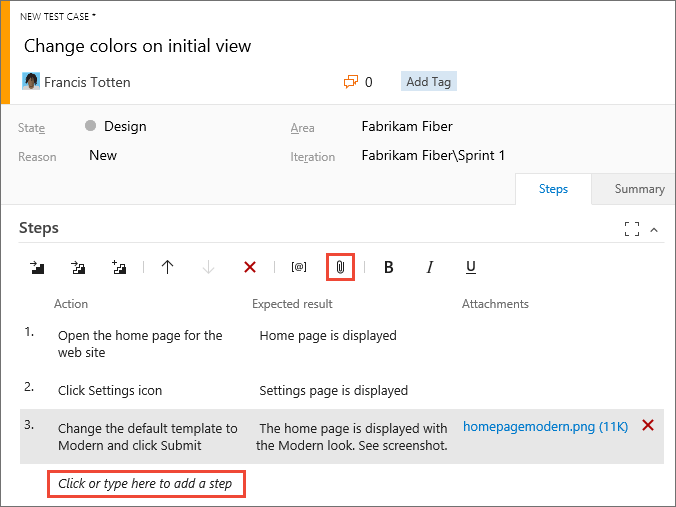
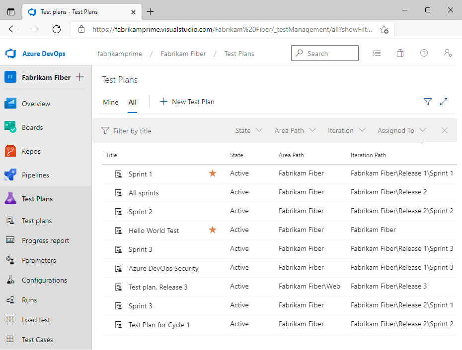
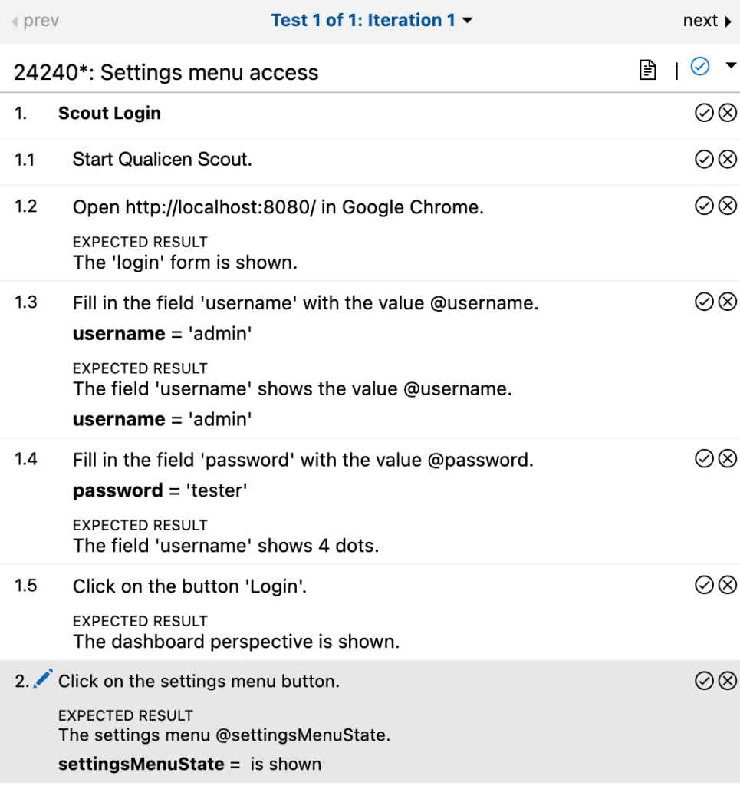
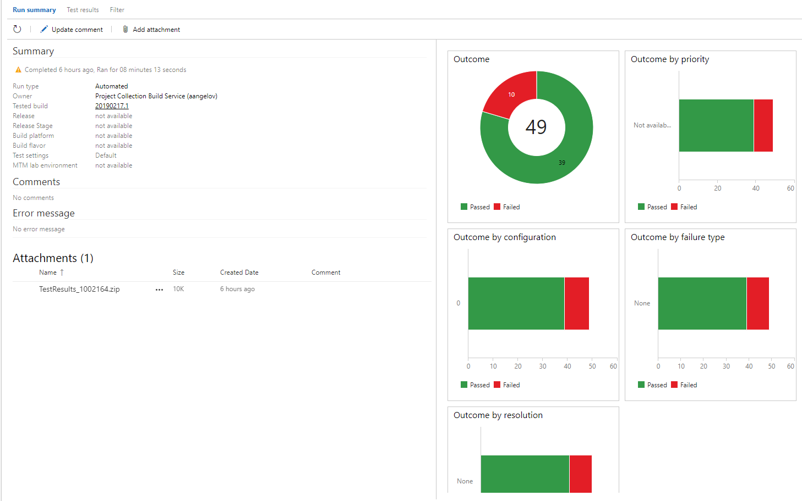
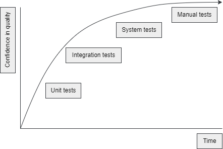

# Integrando testing continuo

## Definiendo calidad

Uno de los primeros objetivos de DevOps es incrementar el flujo de valor del usuario final. Para hacer despliegues más frecuentes, dos cosas son importantes: automatización y calidad. 

Es el momento de empezar a medir la calidad de los cambios. Esto permite abortar cambios que no tienen la suficente calidad.

En software, alta calidada es más caro y/o toma más tiempo. Es una compensación entre el número de caracteristicas que puedes desplegar y la calidad que puede ser garantizada.

Es importante que primero establezcas como medir la calidad del software. Un enfoque común para monitorizar la calidad del software es reunir una o más métricas. Creando graficos de esas métricas sobre el tiepo provee ideas de como la calidad del software ha ido evolucionando.

### Métricas de calidad

Las métricas son un significado de capturar algo que es medido como un número. Las métricas a menudo son usadas para representar una calidad particular que puedes ser duro para cuantificarlo. La calidad  de una pieza de software puede ser muy duro de describirla.

Es importante para realizar esas métricas que sean una buena herramienta pero deben ser siempre usadas con precaución. Puede haber más factores que influyan en la calidad del software que las métricas que se miden. Si bien esto podría mostrar los números deseados en los informes, no necesariamente significa que la calidad del software esté mejorando realmente.

Registrar la velocidad del sprint para que el equipo vea si se vuelve más eficiente con el tiempo suena efectivo; Si el tamaño del equipo varía de un sprint a otro, entonces la métrica podría ser inútil ya que la asistencia influye en la velocidad cada semana. La métrica puede ser fácilmente falsificada si un equipo acuerda multiplicar todas las estimaciones por un número aleatorio en cada sprint.

Es dificil medir objetivamente la calidad del código escrito. Los desarrolladores a menudo tienen opiniones de lo que constituye un buen código, poniendo especial atención al resultado del código usado. Se trata de identificar métricas que pueden ayudar a proporcionar información sobre la calidad del código.

**Porcentaje de compilaciones de integración que fallan:** si el código no compila o pasa tests automáticos entonces esto es un undicador de que no tiene suficiente calidad. El resultado debe ser usado para cancelar un cambio de insuficiente calidad o que debe impactar en una funcionalidad del sistema antes de desplegarlo en la siguiente etapa o despliegue.

**El porcentaje del código cubierto por tests automáticos:** si una larga parte del código esta siendo testeado por tests unitarios, este incrementa la calidad del software.

**La tasa de fracaso del cambio:** este es el porcentaje  de despliegues de nuevas versiones del código que lidera problemas. El servidor web corre sin menmoria despues del despliegue de una nueva versión de la aplicación.

**El conjunto de trabajo sin planificar:** el conjunto de trabajo sin planificar que tiene que ser realizado en un periodod de tiempo puede ser una gran métrica de calidad. Si el trabajo no planificado incrementa, entonces esto debe ser porque la calidad va hacía abajo. Pueden ser incidencias en vivo, errores y parches.

**El número de defectos que son informados por usuarios:** si el número de errores resportados por los usuarios incrementa, esto puede ser signo que la calidad ha declinado. Puede ser otras razones para que el número incremente, como nuevo sistema operativo, un incremento en el número de usuarios, o cambiar las expectativas del usuario.

**El número de problemas conocidos:** inclusio si hay nuevos defectos que estan siendo reportados, si los defectos no son nunca corregidos y el número de incidencias conocidas se mantiene incrementando lentamente, entonces la calidad del software declina sobre el tiempo.

**El conjunto de deuda técnica:** es un termino usado para describir las consecuencias de sacrificar la calidad del software, en pocas palabras, entregar código rápido.

Testear es una actividad qeu es realizada para encontrar y reportar en la calidad del software. Los resultados de los tests pueden ser usados para permitir o cancelar un cambio progresivo de la siguiente etapa del despliegue.

### Deuda técnica

La deuda técnica es un termino que describe el coste futuro de sacrificar la calidad del código for algo diferente. El término deuda implica que se debe algo (tiempo, calidad, atención o trabajo) a la solución. Mientas la deuda no sea saldada, tienes que pagar en la forma de que todos los trabajos se relanticen un poco.

La deuda técnica puede tomar varias formas:

* Código que no esta cubierto por algún tests unitario donde los cambios para la implementación de dicho código no puede sr verificado usando tests originales que son usados para crearlos. 

* Código que no está escrito que se explique por si mismo usando variables y nombres de métodos significiativos.

* Código que no adhiere los principios de código como **KISS**, **YAGNI**, **DRY** y/o **SOLID**.

* Clases que son demasiado complejas por que tienen demasiadas variables y métodos.

* Métodos que son demasiado complejos porque tienen demasiados elementos.

* Clases o nombres de espacios que tienen dependencias circulares en diferentes partes de la aplicación.

* Clases que no adhieren el diseño arquitectónico de la aplicación.

Son varias formas de deuda te´cnica, y puede ser un desafio a supervisar. Existen algunas herramientas disponibles que pueden medir la deuda técnia en el código automaticamente e informarlo.

Mientas la deuda ténica es a menudo considerada cosa mala, hay buenas razones para crear deuda técnica a proposito. Es importante, gestionar la altura de la deuda y asegurar que se puede pagar los interses y que la deuda quede saldada.

Mientas la primera versión es usada para validar las proposiciones del negocio y atraer fondos, los desarrolladores pueden saldar la deuda reimplementando o refactorizando la aplicación.

Otra razón debe ser la oportunidad de mercado o un importante evento de negocio que ha sido planificado meses en anterioridad. Tomando algo de deuda técnica para llegar a los objetivos y entregar en tiempo puede valer la pena.

Sin embargo, nunca pagando la deuda y sólo tomando más deuda, incrementará la deuda en el tiempo que un desarrollador necesita para hacer un cambio. Si esto empieza a ocurrir es inevitable que en algún punto los cambios no valgan la pena realizarlos, debido a que el coste siempre superará los beneficios. 

## Entendiendo los tipos de tests

En el desarrollo tradicional de software, los tests son a menudo ejecutados cuando el desarrollo fue completado, la aplicación fue declarada *dev-done*, las carácteristicas fueron congeladas o en situaciones similares. Después de declarar el desarrollo está realizado, el testeo fue realizado y a menudo un largo periodo de ir y venir entre el testeo y la corrección de incidencias, se realiza el desplieuge. El resultado fue que a menudo algunas incidencias fueron encontradas después del despliegue.

*Shifting left* es un principio de pruebas que establece que las pruebas automatizadas deben realizarse en una etapa más temprana del proceso de desarollo. Si todas las actividades envueltas con el desarrollo son dibujadas en una línea desde el comienzo hasta la liberación, entonces *shifting left* indica acercar las actividades de prueba automatizadas al comienzo.

Para hacer esto, se reconoce una amplia selección de diferentes tipos de pruebas.

* **Pruebas funcionales**: son usadas para probar si la funcionalidad deseada es actualmente realizada por la aplicación.

* **Pruebas no funcionales**: son usadas para verificar si otras propiedades deseadas de la aplicación se realizan y que las propiedades no deseadas no están presentes. 

    

### Tipos de tests funcionales automatizados

Esos tipos de tests pueden ser comparados a lo largo de varios ejes: el tiempo toma crear el tests, el tiempo que toma ejecutar el test y el ámbito o alcance de esos tests.

* Tests unitarios: son rápidos de escribir, y son ejecutados muy rápidos, a menudo en menos de un milisegundo. Testean el ámbito o alcance más pequeño en una aplicación, a menudo una clase o un método. Nunca es necesario cambiarlo.

* Tests de integración: toma más tiempo para escribirlos ya que se ocupan de múltiples unidades que deben configurarse para trabajar juntas. La ejecución de esos tests debe mantenerse rápido, durando desde milisegundos hasta decenas de segundos, lo que significa que, cubrirán una gran parte del código y detectará defectos que son intorducidos con un cambio.

* Tests de sistema: prueba un ensamblado completo o una aplicación.A menudo sueles ser API tests o tests automatizados de UI. Toman un rato crearlos ya que dependen de un despliegue para ejecutarse y a menudo requiere los ajustes iniciales en la base de datos o en otro almacen permanente. Pueden durar minutos su ejecución. El mínimo cambioen la interface puede causar que un conjunto de tests fallen. Pueden detectarse errores que tanto los tests unitarios y de integración no detectaría, ya que ellos ejecutan los tests del sistema ejecutandose.

> [!IMPORTANT]
> Teniendo un largo ámbito de tests tiene sus ventajas e incovenintes. Las ventajas es que detecta más errores. La desventaja es que un tests fallido con muy largo ámbito provee sólo una idea acotada de que fue mal. Requerirá más investigación que el fallo de un test con un ámbito pequeño.

#### Test unitario

Son usados para probar una unidad aislada. Para tener una covertura llena de pruebas, las clases de los tests tendrán uno o más tests por cada método público de la clase de aplicación correspondiente. 

Deben ejecutarse extremadamente rápidos. Para hacer esto posible, cada clase es instanciada sin dependencias. Las dependencias serán reemplazadas por clases que las imitan (mock classes). A la izquirda se muestra la configuración en ejecución, a la derecha la configuración durante los tests:

    

Una clase imitada (mock) implementa la misma interface pero no tiene el comportamiento por defecto asociado. Los mocks pueden ser usados para verificar que operaciones concretas o funciones en una dependencia son llamados. 

        public class WorkDivider
        {
            private readonly IMessageSender _messageSender;

            public WorkDivider (IMessageSender messageSender)
            {
                _messageSender = messageSender;
            }

            public void DivideWork(IEnumerable<WorkOrder> workOrders)
            {
                foreach (var workOrder in workOrders)
                {
                    _messageSender.SendMessage(workOrder.GetMessage());
                }
            }
        }

Para instanciar esta clase en un test automatizado, la implementación de la inteface IMessageSneder es necesario. Para trabajar con la dependencia un framework de Mocks como [Moq](https://github.com/devlooped/moq) puede ser usado para tstear *WorkDiver*. En los eemplos [NUnit](https://nunit.org/) es usado como framework de testing.

        [TestFixture]
        public class WorkDividerTest
        {
            private Mock<IMessageSender> _messageSender;
            private WorkDivider _subject;

            [SetUp]
            Public void SetUp() 
            {
                _messageSender = new Mock<IMessageSender>();
                _subject = new WorkDivider(_messageSender.Object);
            }

            [Test]
            public void WhenSendingAnEnumerableOfWorkingOrders_EverOrderIsSendToTheMessageSender()
            {
                var workOrder = new WorkOrder();
                
                _subject.DivideWork(new [] {workOder });

                _messageSender.Verify(x => x.SendMessage(workOrder), Times.Once);
            }
        }

Esto significa que no es posible escribir tests unitarios para clases que interactuan con otros sistemas, como bases de datos, caches o colas de mensajes. Es común practicar para aislar la integración con otros sistemas en clases separadas. Esas clases contienen la interación con el sistema remoto, pero no logica de negocio y con el menor código posible. Entonces, se aceptan que esas clases no son convertidas por tests unitarios. El patrón de diseño típico usado para hacer esto es **Facade**, **Adapter** y **Repository patterns**. 

Los tests unitarios eben estar listos para correr en el ordenador de cada desrrollador que clona el código base de una aplicación. No requiere alguna configuración o instalación especial. Todas las personas que trabajan con el código base puede ejecutar los tests en su ordenador local. Una buena practica para los desarrolladores es ejecutar todos los tests unitarios en sus computadores antes de subir los cambios al repositorio.

Los tests unitarios deben también ser parte de la integración continua.

#### Tests de integración

Los tests de integración son usados para testear si un grupo de componentes trabaja juntos correctamente. 

* Incrementando la cobertura de tests para aquellas partes de la aplicación que no este cubierto por tests unitarios, como clases que interactuan con otros sistemas.

* Direccionando riesgos que no son direccionados en tests unitarios y mitigando riesgos donde los componentes individuales estan interactuando con otros sistemas para verificar los resultados deseados.

Puede ser duro comprender que riesgos de integración pueden existir. Partes individuales o componentes están trabajando como por sus especificiaciones, la solución completa debe ser propiedad de función. 

Los test de integración, especialmente aquellos que interactuan con otros sistemas no sólo tomará más tiempo para ejecutarse que los tests unitarios sino que a menudo requiere más instalación o configuración para ejecutarse. Esto debe incluir secretos como nombres de usuarios, contraseñas o certificados. Para gestionar la configiuración como esto, un fichero de settings puede ser creado junto a los tests cuya configuración es cargada anteriormente para ser ejecutados. Cada desarrollador puede crear su copia del fichero y ejeecutar los tests usando su propia configuración.

La clase **MessageSender** que implementa el interfaz **IMessageSender** necesita una cadena de conexión para hacer su trabajo.

        [TextFixture]
        public class MessageSenderText
        {
            private MessagSender _messageSender;

            [SetUp]
            public void SetUp()
            {
                var connectionString = TEstContext.Parameters["MessageSenderConnectionString"];
                _messageSender = new MessageSender(connectionString);
            }
        }

La clase *MessageSender* necesita un *connectionString* para construirse y es recibido desde el objeto *Parameters* en *TextContext*. Esto usa el enfoque **NUnit** para hacer settings desde el fichero *.runsettings* disponible.

        <?xml version="1.0" encodign="utf-8"?>
            <RunSettings>
                <TestRunParameters>
                    <Parameter name="MessageSenderConnectionString" value="secret-value" />
                </TestRunParameters>
            </RunSettings>
        </xml>

Moviendo los ajustes en un fichero separado asegura que los secretos no son comprobados por la fuente de control. En la ejecución de tests in una sección de la pipeline, aprenderás homo compilar un fichero *.runsettings* para eejcutar tests en una pipeline.  

Esto es porque los tests de integración deben también ser parte de la integración continua si es posible. Hay un riesgo y es que se realice demasiado lento.

* Los tests de integración son ejecutados en una compilación separada que es lanzada en paralelo para la integración continua. La duración es corta mientras los tests de integración están también ejecutandose.

* Los tests de integración son ejecutados después en la pipeline, junto a la liberación del software, antes o después del despliegue al entorno de testing.

La desventaja del primer enfoque es que los tests ya no funcionarán como puerta de calidad antes de que el código sea mergeado en la rama master. Esto significa que mientras que los errores pueden ser mergeados, ellos serán detectados e informados por la compilación.

El segundo enforque no debe tener este riesgo. Sin embargo, la ejecución debe ser diferido en un momento posterior, como la última parte de la pipeline de liberación. Esos defectos podrían hacerse visibles más tarde, extendiendo el tiempo entre la detección y la corrección de un error.

En cada enfoque, falla la integración de tests que no bloquearán los merges de los cambios y por eso, hay que encontrar otra manera de asegurar que los desarrolladores tomarán la responsabilidad de corregir los defectos que causaron el fallo en los tests.

#### Tests de sistema

Estos tests son para ejecutarlos contra una aplicacón ensamblada y en ejecución. Tiene dos nombres, API tests o UI tests. Puede tomar un largo tiempo ejecutarlos.

> [!TIP]
> Podrías encontrar algo llamado **coded UI Tests**, actualmente deprecado. [https://devblogs.microsoft.com/devops/changes-to-coded-ui-test-in-visual-studio-2019](https://devblogs.microsoft.com/devops/changes-to-coded-ui-test-in-visual-studio-2019)

Estos tests necesitarán configuración e instalación antes de ser ejecutados. La aplicacion necesita er ejecutada en un entorno controlado y todas las integraciones con almacenamientos de datos necesitan estar totalmente operativos. Integraciones con otros sistemas necesitan estar levantados y ejecutandose.

Cuando estan ejecutandose tests de sistema como parte de una pipeline, a menudo se ejecutan después que el código haya sido desplegado en el último entorno. Esto implica que los tests de sistema son la ruta crítica desde que el código fuente se despliegue en producción. Si esta ruta tarda demasiado, ellos pueden ser ejecutados fuera de la pipeline. Ellos deben ejecutarse en una programación de tiempo. Esto dará velocidad a tu pipeline, pero eliminará la oportunidad de usar tests de sistemas como calidad.

Tests de sistemas y UI tests en particular, son a menudo frágiles y pueden parar de trabajar inesperadamente después de un cambio mínimo. Es una advertencia que mantengas su númeor lo más bajo posible. Puede capturar errores particulares, como una desconfiguración o otros errores de ejecución, datos no relacionados en la base de daots, o series de operaciones que crean estados de error.

#### Flaky tests

Son tests que fallan con un cambio no evidente en el código o en la configuración, o el código trabaja en una máquina local pero falla en la integración continua. 

Son desconfiables y tienen un impacto negativo en la calidad. Una solución para erradicar los problemas de flaky tests es silenciar esos tests si la integración continua y la libración no falla y el desconfiable resultado de los tests son exluidos desde tu repositorio de tests automatizados. 

### Tipos de test funcionales manuales

Mientras automatizas tests es una gran herramienta recibir feedback y a menudo, hay cosas que deben ser testeadas manualmente. 

El beneficio de esto es que toda esa actividad automaitzada añadida que podemos tener en la versión de la aplicación que esta siendo testeada, incrementa los cambios que la versión también será testeada manualmente. Cuando se inicia las pruebas manuales, debe ser muy diferente que algún nuevo error será descubierto. 

Tipos de tests manuales:

* Scripted tests

* EXploratory tests

#### Pruebas escritas

Pruebas escritas (scripted testing) es una tecnica que es usada para minimizar el conjunto de tiempo gastado en la ejecución de tests mientras aseguras una cobertura total de todos los casos relevantes. Esto esta hecho diviendo los tests in dos fases: preparación y ejecución. La preparación esta hecha en paralelo para el desarrollo de la caracteristica que esta para probar o antes de que se inicie el desarrollo. Durante la preparación, la caracteristica es analizada y son identificados los casos a probar.

Una vez que el tests debe ser ejecutado es identificado, las pruebas de scripts manuales son escritas que describen cada paso que deben ser tomados durante la fase de ejecución posterior. Mientras esto toma más tiempo en preparar, todo esto asegura que la ejecución del tiempo gasta poco tiempo.

Mientras eres responsable de la creación de casos, Azure DevOps te apoya en esto. Usando la herramienta Test Plans, puedes crear y registra los casos para una rápida ejecución posteriormente.

1. Abre el menu **Azure Test Plans**

    

2. Clica en **Test plans**. Se te presentará descripción general de todos los planes que tengas actualmente.

3. Clica el botón **New Test Plan** para iniciar a crear un nuevo plan. Esto te abrirá un nuevo dialogo.

    

4. Escribe el nombre del plan.

5. Vincula el plan con el correcto area.

6. Selecciona la iteracción, o sprint, que esta prueba relaciona.

7. Clica en **Create** para finalizar el plan.

Un plan puede ser dividido en diferentes conjuntos de pruebas, con lo que ser subdividido en diferentes conjuntos de prueba a la vez. Los conjuntos de pruebas pueden ser manejados haciendo click en el botón elipsis que aparece sobre el conjunto de tests.

Después de crear un plan, es hora para añadir uno o más conjuntos de tests al plan. Para hacer esto, asegurate que la pestaña **Define** esta abierta para el conjunto de tests y clica el botón **New Tests Case**. Una nueva ventana aparecerá.

    

1. Introduce un titulo para el tests case.

2. Introduce una o más acciones y los resultados esperados que describen el caso en detalle.

3. Clica en el botón **Save & Close**.

Una vez la preparación está hecha y una característica está lista para ser testeada, todos los tests son ejecutados. Ya que todas las pruebas están escritas, esto puede ser hecho rápidamente y efectivamente. Podría haber desarrolladores, analistas de negocio o otras personas de la compañía ayudando a la ejecución de tests. Esto significa que el test de ejecución será muy rápido.

1. Navega a la pestaña **Execute**.

    

2. Selecciona uno o más casos.

3. Selcciona uno de las opciones a ejecutar en la esquina superior derecha.

Cuando eliges ejecutar la prueba contra una aplicación web, un nnuevo navegador con la prueba se abrirá. Esta prueba puede ser usada para ir mediante el caso y para cada caso mediante todos los pasos, manteniendo una traza de todos los pasos correctos y erroneos. 

    

La marca de verificación o error después de casa paso puede ser usada para trazar los resultados. Si el paso es marcado como incorrecto, un comentario debe ser añadido. Para marcar el caso como pasado o marcado, debe usarse el menu lista azul situado en la esquina superior derecha. Una vez todos las pruebas sean realizadas, el reultado puede ser guardado usando el botón **Save and close** situado en la esquina superior izquierda.

Para ver el resultado de las pruebas, navega a **Test Plan** y luego **Runs** para obtener la siguiente panel:

    

Puedes seleccionar el ejecutador que quieres ver los resultados para obtener rápidamente una descripción general de los resultados. En la pestaña **Test results** es posible ver una lista de todos los casos  y si han pasado o no.

Un beneficio de tener el detalle escrito es que el mismo tests puede ser realizdo más de una vez reduciendo el coste por ejecución. Si el plan es ejecutado varias veces, el historico es mantenido y puede ser accedido usando la vista en la imagen anterior. Como parte de las pruebas de regresión puedes automatizar las pruebas usando pruebas del sistema.

> [!TIP]
> Es posible ejecutar la misma prueba varias veces, pero para diferente configuración. Esto es a menudo hecho para probar con diferentes navegadores. [https://docs.microsoft.com/en-us/azure/devops/test/mtm/test-configurations-specifying-test-platforms?view=azure-devops](https://docs.microsoft.com/en-us/azure/devops/test/mtm/test-configurations-specifying-test-platforms?view=azure-devops)

#### Pruebas exploratorias

Una vez que las pruebas sean automatizadas, ellas caerán en la categoria de pruebas de sistema, y pruebas automatizadas UI en particular. 

Ahí estarán cosas que el ojo humano podrá captar y que una computadora no, como interfaces que no son amigables, elementos no alineados, lineas de testo o imagenes que no estan totalmente mostrados siendo ocultados por otros elementos.

Para capturar esos errores mientras no gastas una gran cantidad de tiempo escribiendo tests, las pruebas exploratorias puede ser la solución. En este enfoque, un probador abre la aplicación e inicia la investigación de esas partes de la aplicación que piensan que contienen más riesgo con respecto al siguiente despliegue. El probado también mantendrá una traza de los nuevos riesgos identificando aquellos casos que no hayan sido realizados. Una vez las pruebas exploratosias sean ejecutadas, el probado puede informar en las aras de la aplicación y los casos que han sido cubiertos, cuales no y que riesgos siguen sin explorarse del todo.

Las pruebas exploratorias significan que el probador verifica si la aplicación está trabajando correctamente.

Las pruebas exploratorias es una gran herramientas cuando el tiempo es limitado o el tiempo disponible para probar no se sabe de antemano.

#### Informan los resultados de pruebas manuales

El informe indicaalgún defecto o otra incidencia encontrada. Debes intentar y reproducir la incidencia una vez más, intentando recordar como se ha generado el error, y escribir todos los pasos. Entonces, tnatos los resultados deseados como los no deseados deben ser descritos, pantallazos deben ser tomados y todo tiene que ser insertado en la traza de errores o en la herramienta de gestión de trabajo, como Azure DevOps.

La extensión **Test & Feedback** de Azure DevOps te ayuda a hacer esto fácilmente. Esta simple extensión provee botones para grabar pantallazos o videos y anotar en ellos testos y dibujos. Una vez un error ha sido encontrado y documentado por una grabación, será automaticamente guardado en Azure Boards.

> [!IMPORTANT]
> Puede ser usado cuando las pruebas sean escritas y realizar pruebas de exploramiento a la vez.

### Estrategias para decidir que tipo de test funcional necesitas

El siguiente diagrama muestra la relación entre el tiempo que toman los diferentes tipos de tests para ejecutarse y la confianza en la calidad del software que provee. Tests manuales tienen la alta probabilidad de identificar algún defecto. Los tests automatizados pueden llevarse a cabo limitandose a unos pocos minutos.

    

A menudo tiene sentido por que los tests unitios son preferidos sobre loos tests de integración, integración sobre sistemas y tests manuales sobre los tests automatizados.
