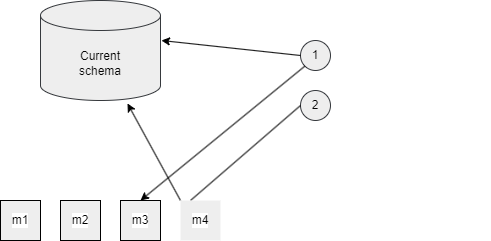
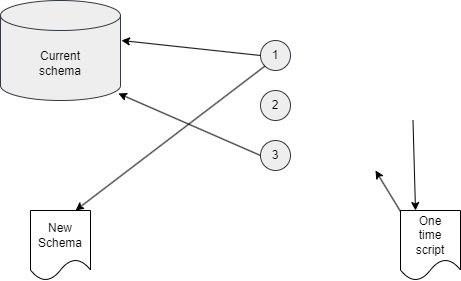

# Tratando con base de datos en DevOps

## Gestionando el esquema de base de datos como código

ORM (**Object-relational mapper**) fue introducido para rellenar el desajuste entre la programación orientada a objectos y el esquema relacional de base de datos, que trabaja con tablas. Algunos ejemplos son NHibernate y Entity Framework.

Los ORMs proveen una capa de abstracción que permite el almacenamiento y recuperación de objetos desde la base de datos sin preocuparse de la estructura de la tabla. Para realizar el mapeo automatizado los ORMs a menudo tienen capacidades de compilación para desribir el esquema de base de datos, el modelo de objetos correspondiente y el mapa entre ellos en un lenguaje de marcado. Elllos pueden generar desde un modelo de objetos o una base de datos existente y el mapeo entre ellos, mediante convenciones, generados o pintados en un editor visual.

Para gestionar los cambios del esquema como código, hay dos enforques disponibles. El primero describe cada cambio en código (*basado en migraciones*); el otro describe sólo la última versión del esquema en código (*basado en el estado*). Ambos pueden confirar en heramientas de terceras partes para aplicar los cambios a la base de datos.

### Migrations

El primer enfoque es basado en mantener un ordenado conjunto de cambios que tienene que ser aplicados en la base de datos. Las **migraciones** pueden ser generadsas por herramientas tales como Microsoft Entity Framework o Redgate SQL Change Automation, o ellos pueden ser escritos a mano.

Las herramientas pueden automaticamente generar el script de la migración basada en la comparación del actual esquema y del nuevo esquema en el control de versiones. A esto se le llama **scaffolding**. Los scripts generdos por las herramientas no siempre son perfectos, y ellos tiene que ser mejorados aplicando el cónocimiento que el programador tiene.

Las etiquetas **m1** a la **m4** describen los cambios incrementales. Para modificar la base de datos a la última versión, la última migración aplicada es determinante y todas las migraciones posteriores que son añadadidas una después de otra.

Cuando edistas las migaciones a mano debes mantener en mente:

* La migración debe ser ordenada. Ddscriben las sentencias SQL que necesita ser ejecutadas en orden. La siguiente migración puede ser iniciada sólo cuando esta estapa este completada.

* Debe migrar no sólo el esquema también los datos. Esto puede significar que varias etapaas son necesarias entre migraciaciones.

* Indices extra y restricciones deben ser aplicadas no sólo en la base de producción. Asegurar que los indices y las restricciones son aplicadas en el mismo orden y no pueden bloquear migraciones existiendo sólo en proudcción.

* La migración debe ser realizada idempotente. El retorno de la última migración es una gran manera de asegurarse que está totalmente aplicada.

Una desventaja de este enfoque es el estricto orden requerido que es impuesto en la generación y aplicación de migraciones generadas. Esto hace duro la integración de este enfoque en el dessarrollo del workflow que dependende duramente del uso de ramas.

Las migraciones creadas en diferentes ramas que son mergeadas juntas sólo la última debe romper el orden de las migraciones o, peor aún mergear una separación en la ruta de la migración. La única manera de que el error pueda ser corregido es realizarlo en varias etapas:

1. Eliminar todas las migracaciones a partir de la nueva.

2. Aplicar todas las otras migraciones a labase de datos que no tiene nuevas migraciones aplicadas.

3. Generar nueva migración para las otras migraciones.

Una ventaja de este enfoque es que cada individual esquema puede ser desplegado contra la base de datos en la misma manera. Ello ejecutará aún una por una en un predecible orden y en la misma manera en el que ellos corrieron contra el entorno de etests, incluso si ellos son aplicados uno por uno.

### Estado final

A diferencia del enfoque de gestionar cambios del esquema, este no mantiene la traza de los cambios individuales, sólo almacena la última versión del esquema en el control de versiones. Herramientas externas como Microsoft VIsual Studio y Redgate's SQL Data Compare son usadas para comparar el actual esquema en el control de versiones con el actual esquema de base de datos, generando scrips de migración y aplicandolos cuando se ejecuta. Los scripts de migración no estan almacenados y son de un único uso.

A diferencia de escribir migraciones, no es factible eejcutar tareas a mano. Mientras tracenando la nueva versión del esquema a mano en el control de versiones puede ser gestionado, el mismo no es factible por el enfoque estado final. Generando scripts de migración mientras se compara lel esquema existente y el nuevo esquema y aplicando las migraciones solo puede ser hecho usando herramientas, tales como Redgate SQL Source Control y SQL Server Data Tools.

El esquema de la base de datos actual y la descripción de la base de datos deseada son comparadas para generar una mejora y directamente aplicar un script para hacer los camos necesarios para que el esquema actual sea el mismo que el esquema deseado.

Una ventaja de este enfoque es que no genera una serie de scripts que deben ser ejecutados en un orden especifico. Este enfoque combina fácilmente con ramas de esquemas donde los cambios son integrados más lentamente cada vez. También remueve la necesidada de escribir migraciones a mano para escenarios simples, tales como añadir o eliminar una columna, tabla o indice. 

La desventaja de este enfoque es que hace difícil gestionar los cambios que necesita las operaciones de datos. Desde las herramientas solo haces cumplir el nuevo esquema, esto dirige los datos perdidos y no hay intervención.

Una posible manaera de intervenir para evitar estar añadiendo scripts pre-despliegue y post-despliegue en el paquete de esquema, es que en el script de pre-despliegue se guadarse los datos en una tabla temporal. Después de aplicar el nuevo esquema los datos son compiados desde la tabla temporal a su nueva localización en el script post-despliegue.

## Aplicando cambios en el esquema de la base de datos

Cuando aplicas cambios al esquema de la base de datos, existen dos métodos para hacerlo. Cambios que pueden ser aplicados prioritariamente para desplegar en la nueva versión de la aplicación, o por el código proprio de la aplicación.

### Mejorando como parte de la release

El primer enfoque para aplicar cambios en la base de datos como parte de una release. Cuando esto es el caso, la herramienta que es la responsable de leer y ejecutar el script de migracion es invocada usando una tarea en la pipeline. 

Puede ser realizado usando un script personalizado en PowerShell o otro lenguaje de scripting. Esto es propenso a generar errores, y con cada cambio de la herramienta es un riesgo que los scripts necesiten ser modificados. La mayoría de las herramientas basadas en migraciones, como las tareas de Azure Pipelines que están disponibles para iniciar la migración desde la liberación (release).

Otra variación es separar entre las fases de la aplicación compilación y la liberación (release). Los scripts migración son exportados como un artefacto compilado separado, desde el código fuente o después de ejecutar una herramienta que genera el script SQL necesario. Este arttefacto es entonces descargado contra la fase de la libración (release) dde es aplicado para la baes de datos usando una tarea de Azure Pipelines para ejecutar SQL.

