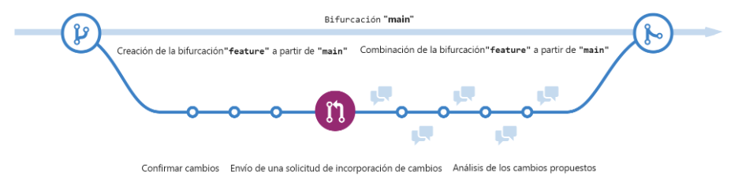
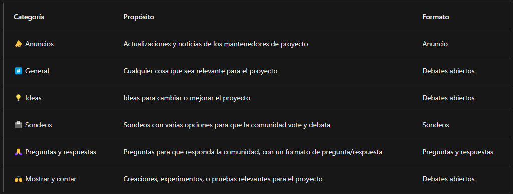

# Introducción a GitHub

Proporciona una plataforma para desarrolladores con tecnología de inteligencia artificial para compilar, escalar y entregar software seguro.

## ¿Qué es GitHub?

Es una plataforma basada en la nube que usa Git, simplifica el proceso de colaborar en proyectos y proporciona un sitio web, herramientas de línea de comandos y un flujo global que permite a los desarrolladores y usuarios trabajar juntos.

### Colaboración

La colaboración es la base de todo lo que hace GitHub. GitHub tiene un conjunto de herramientas sin fisuras que permiten colaborar sin esfuerzo.

Los repositorios, las incidencias, las solicitudes de incorporación de cambios y otras herramientas ayudan a los desarrolladores, administradores de proyectos, líderes de operaciones y otros usuarios de la misma empresa. Les permite trabajar juntos con mayor rapidez, reducir los tiempos de aprobación y realizar las entregas más rápidamente.

### Productividad

Se acelera con la automatización que proporciona la plataforma GitHub Enterprise. Con las herramientas de CI/CD (integración continua y entrega continua) integradas directamente en el flujo de trabajo. Esto proporciona a los desarrolladores más tiempo para crear soluciones innovadoras.

### Seguridad

La plataforma GitHub Enterprise incluye características de seguridad nativas y de primera entidad que minimizan el riesgo de seguridad con una solución de seguridad integrada. Al mismo tiempo, puede aprovechar las ventajas de la información general de seguridad y Dependabot.

### Escala

La plataforma GitHub Enterprise se centra en la experiencia del desarrollador. Tiene la escala necesaria para ofrecer perspectivas que cambian el sector, capacidades de colaboración para una eficiencia transformadora, las herramientas para aumentar la productividad, seguridad en cada paso y la inteligencia artificial para impulsarlo todo a nuevas cotas en una única plataforma integrada.

## Introducción a lorepositorios

### ¿Qué es un repositorio?

Un repositorio contiene todos los archivos de tu proyecto y el historial de revisiones de cada uno de ellos. Puede utilizar repositorios para administrar el trabajo, realizar un seguimiento de los cambios, almacenar el historial de revisiones y trabajar con otras personas.

### Creación de un repositorio

1. En la esquina superior derecha de cualquier página, utilice el menú desplegable y seleccione Nuevo repositorio.
2. Use el menú desplegable Propietario para seleccionar la cuenta que quiere que sea propietaria del repositorio.
3. Teclea el nombre de tu repositorio, y una descripción opcional.
4. Elige la visibilidad del repositorio.
    - Los repositorios públicos son accesibles para todo el mundo en Internet.
    -  Los repositorios privados solo pueden acceder usted, las personas con las que comparta explícitamente el acceso y, en el caso de los repositorios de organizaciones, determinados miembros de la organización.
5. Seleccione Crear repositorio y ¡enhorabuena! Acaba de crear un repositorio.

### Adición de un archivo al repositorio

1. En GitHub.com, vaya a la página principal del repositorio.
2. En su repositorio, vaya a la carpeta donde quiere crear un archivo seleccionando el vínculo crear un nuevo archivo o cargar un archivo existente.
3. Una vez agregado, encima de la lista de archivos seleccione el menú desplegable Agregar archivo ᐁ. Después seleccione Crear nuevo archivo.
4. En el campo de nombre, teclea el nombre y la extensión del archivo. Para crear subdirectorios, escriba el separador de directorios /.
5. En el cuadro de texto de contenido del archivo, escriba contenido para el archivo.
6. Para revisar el nuevo contenido, encima del contenido del archivo, seleccione Vista previa.
7. Seleccione Commit changes (Confirmar cambios).
8. En el campo Confirmar mensaje, escriba un mensaje de confirmación breve y significativo que describa el cambio realizado en el archivo. Puedes atribuir el cambio a mas de un autor en el mensaje del mismo.
9. Si tiene más de una dirección de correo electrónico asociada a su cuenta en GitHub.com, seleccione el menú desplegable de dirección de correo electrónico. Después, seleccione la dirección de correo electrónico que desea usar como dirección de autor de Git. Únicamente las direcciones de correo electrónico verificadas aparecen en el menú desplegable. Si ha habilitado la privacidad de la dirección de correo electrónico, entonces [nombreDeUsuario]@usuarios.noreply.github.com es la dirección de correo electrónico predeterminada del autor de la confirmación.
10. Debajo de los campos Mensaje de confirmación, decida si desea agregar la confirmación a la rama actual o a una nueva rama. Si su rama actual es la rama predeterminada, deberá elegir crear una nueva rama para su confirmación y después crear una solicitud de cambios.
11. Seleccione Confirmar cambios o Proponer cambios.

### ¿Qué son los gists?

Las gists son una forma simplificada de compartir fragmentos de código con otras personas.

Cada gist es un repositorio Git, que puede bifurcar y clonar y que puede ser público o secreto. Los gists públicos se muestran públicamente, donde se pueden consultar los nuevos a medida que se crean. Los gists secretos no se pueden buscar, pero no son completamente privados. Si envía la dirección URL de un gist secreto a un amigo, podrá verlo.

### ¿Qué son las wikis?

Cada repositorio incluye una sección para hospedar documentación, denominada wiki. Aunque un archivo LÉAME indica rápidamente lo que puede hacer el proyecto, puede usar una wiki para proporcionar documentación adicional.

## Componentes del flujo de GitHub

### Qué son las ramas

Las ramas son una parte esencial porque en ellas es donde podemos realizar cambios sin que afecten a todo el proyecto en el que estamos trabajando.

La rama es un lugar seguro para experimentar con nuevas características o correcciones. Si comete un error, puede revertir sus cambios o insertar más cambios para subsanarlo. Los cambios no se actualizarán en la rama predeterminada hasta que combine la rama.

### ¿Qué son las confirmaciones o commits?

Una confirmación es un cambio en uno o varios archivos de una rama. Cada vez que se crea una confirmación, se le asigna un identificador único y se realiza un seguimiento de ella, junto con la hora y el colaborador. Las confirmaciones proporcionan un registro de auditoría claro para todas las personas que revisen el historial de un archivo o un elemento vinculado, como una incidencia o una solicitud de incorporación de cambios.

Los estados principales de un archivo en un repositorio Git son Sin seguimiento y Con seguimiento.

- Sin seguimiento: estado inicial de un archivo cuando aún no forma parte del repositorio de Git. Git desconoce su existencia.

- Con seguimiento: un archivo con seguimiento es aquel que Git supervisa activamente. Puede estar en uno de los siguientes subestados:

    - Sin modificar: se realiza un seguimiento del archivo, pero no se ha modificado desde la última confirmación.
    - Modificado: el archivo se ha cambiado desde la última confirmación, pero estos cambios aún no están almacenados provisionalmente para la siguiente confirmación.
    - Almacenado provisionalmente: el archivo se ha modificado y los cambios se han agregado al área de almacenamiento provisional (también conocida como índice). Estos cambios están listos para confirmarse.
    - Confirmado: el archivo se encuentra en la base de datos del repositorio. Representa la versión confirmada más reciente del archivo.

### ¿Qué son las solicitudes de incorporación de cambios o pull requests?

Es un mecanismo que sirve para indicar que las confirmaciones de una rama están listas para combinarse en otra. 

El miembro del equipo que envía la solicitud de cambios normalmente pide a uno o varios revisores que comprueben el código y aprueben la combinación. Estos revisores podrán comentar los cambios, agregar otros o usar la solicitud de incorporación de cambios para realizar un análisis más exhaustivo. 

Una vez que los cambios se han aprobado, la rama de origen de la solicitud de incorporación de cambios se combina con la rama base.

### El flujo de GitHub

El flujo de GitHub se puede definir como un flujo de trabajo ligero que permite experimentar de forma segura. 

1. Comience por crear una rama para que los cambios, características y correcciones que cree no afecten a la rama principal.
2. Realice los cambios. Se recomienda implementar cambios en la rama de características antes de combinarlos en la rama principal. 
3. Cree una solicitud de cambios para pedir comentarios a los colaboradores. La revisión de solicitude sde cambios es tan valiosa que algunos repositorios requieren una revisión aprobatoria antes de que estas se puedan fusionar.
4. Revise e implemente los comentarios de sus colaboradores.
5. Una vez que esten bien los cambios, es el momento de aprobar la solicitud de cambios y combinarla en la rama principal.
6. Puede eliminar la rama. Al eliminar la rama se indica que el trabajo en la rama se ha completado y se evita que usted u otros usuarios empleen accidentalmente ramas antiguas.

## GitHub es una plataforma colaborativa

### Issues

Las Incidencias de GitHub se crearon para realizar un seguimiento de ideas, comentarios, tareas o errores para trabajar en GitHub. Las incidencias se pueden crear de varias maneras, por lo que puede elegir el método más conveniente para su flujo de trabajo. Maneras de crear una incidencia: 

* Un elemento de una lista de tareas.
* Una nota en un proyecto.
* Un comentario en una incidencia o una solicitud de incorporación de cambios.
* Una línea de código específica.
* Una consulta de dirección URL.

#### Crear una propuesta desde un repositorio

1. Vaya a la página principal del repositorio.
2. Debajo del nombre del repositorio, seleccione Incidencias.
3. Seleccione Nueva incidencia.
4. Si el repositorio usa plantillas de incidencias, junto al tipo de incidencia que desee abrir, seleccione Comenzar. Si el tipo de incidencia que desea abrir no están incluida en las opciones disponibles, seleccione Abrir una incidencia en blanco.
5. En el campo Agregar título, escriba el título de la incidencia.
6. En el campo Agregar descripción, describa la incidencia.
7. Si es un mantenedor de proyectos, puede asignar la incidencia a alguien, agregarla a un panel de proyecto, asociarla a un hito o aplicar una etiqueta.
8. Cuando haya terminado, seleccione Enviar nueva incidencia.

### Debates

Los debates son para conversaciones que deben ser accesibles para todos los usuarios y que no están relacionadas con el código. Los debates habilitan las conversaciones abiertas y fluídas en un foro público.

#### Hablitación de un debate en el repositorio

Los propietarios de repositorios y los usuarios con acceso de escritura pueden habilitar los Debates de GitHub para una comunidad en sus repositorios públicos y privados. La visibilidad de un debate se hereda del repositorio en el que se crea el debate.

1. Ir a la página principal del repositorio.
2. En el nombre del repositorio, seleccione Configuración.
3. Desplácese hacia abajo hasta la sección Características y, en Discusiones, seleccione Discusiones de configuración.
4. En Iniciar una nueva discusión, edite la plantilla para alinearse con los recursos y el tono que desea establecer para la comunidad.
5. Seleccione Iniciar discusión.

#### Creación de un nuevo debate

Cualquier usuario autenticado que pueda ver un repositorio puede crear un debate en dicho repositorio.

1. Ir a la página principal del repositorio o la organización donde desea iniciar un debate.
2. En el nombre del repositorio u organización, seleccione Discusiones.
3. Seleccione Discusión nueva.
4. Seleccione una categoría de discusión seleccionando Comenzar. Todos los debates deben crearse en una categoría. En el caso de los debates del repositorio, las personas con permisos de mantenedor o administrador en el repositorio definen las categorías de los debates de dicho repositorio.

Cada categoría debe tener un nombre único, un emparejamiento de emojis y una descripción detallada que indique su propósito.

1. En Título de la discusión escriba un título para la discusión y, en Escribir, escriba el cuerpo de la discusión.
2. Seleccione Iniciar discusión.